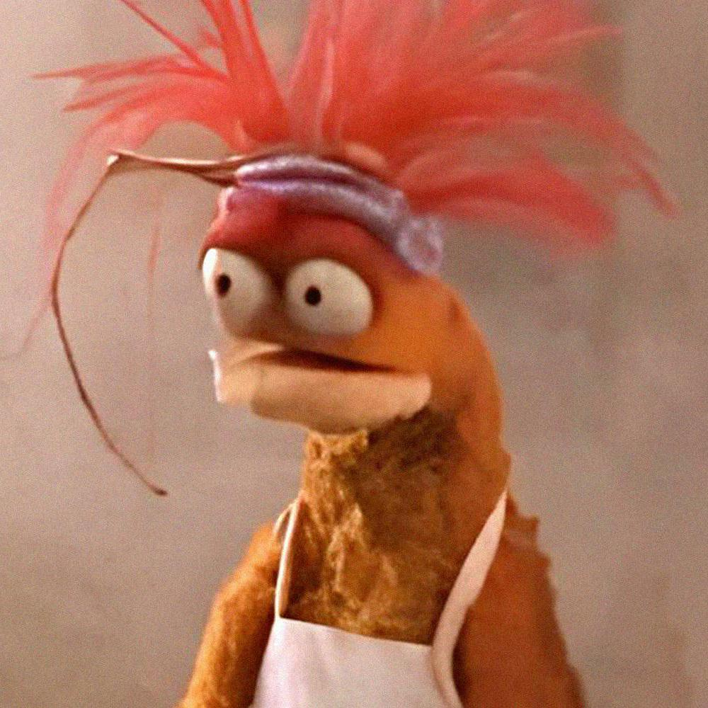

## Hiii there 👋
- 🌱 Im currently studying computer science:
- 💻 I've learned python 
- 💬 currently learning java 
- 🎮 I like playing videos games like minecraft and palia.
- 📫 can reach me: mec66062@email.vccs.edu
- 💬 How do you feel about java?
Markdown syntax: 

<!--
**kenzee03-coder/kenzee03-coder** is a ✨ _special_ ✨ repository because its `README.md` (this file) appears on your GitHub profile.

Here are some ideas to get you started:

- 🔭 I’m currently working on ...
- 🌱 I’m currently learning ...
- 👯 I’m looking to collaborate on ...
- 🤔 I’m looking for help with ...
- 💬 Ask me about ...
- 📫 How to reach me: ...
- 😄 Pronouns: ...
- ⚡ Fun fact: ...
-->
